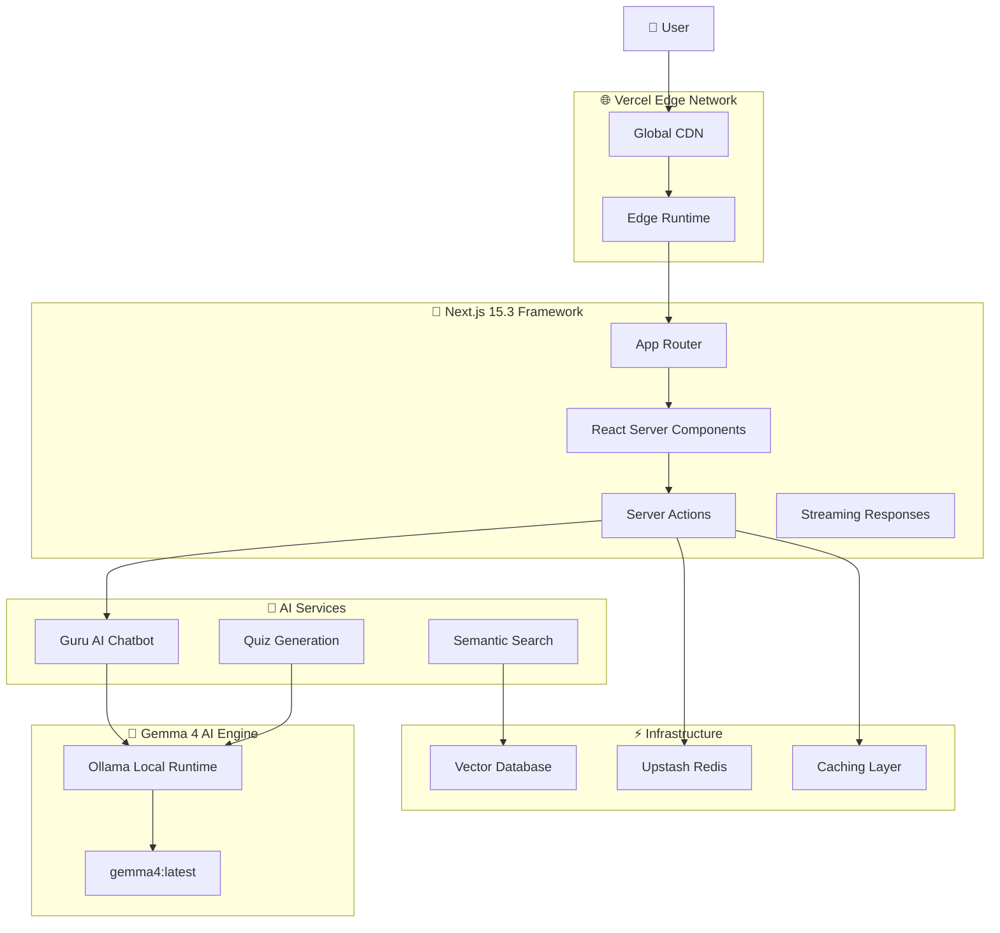

# 🕉️ Hind AI - Ancient Wisdom Meets Modern AI

<div align="center">
  
  
  
  
  
  
</div>

<div align="center">
  
</div>

> **🧘‍♂️ Your AI Guru for Ancient Wisdom | ज्ञान से मोक्ष तक (From Knowledge to Liberation)**

**Hind AI** is a cutting-edge AI-powered spiritual learning platform that democratizes access to ancient Indian wisdom using **Gemma 4 8B via Ollama**. Our platform features advanced RAG pipelines, multimodal Sanskrit analysis, function calling tools, and complete offline capability - all built for the Kaggle Gemma 4 Hackathon.

```
"सत्यमेव जयते · नमस्ते · ॐ" - Truth Alone Triumphs · Welcome · Om
```

🌐 **Live Demo**: [https://hindai-nine.vercel.app](https://hindai-nine.vercel.app)  
📚 **Repository**: [https://github.com/mangeshraut712/Hindai](https://github.com/mangeshraut712/Hindai)  
🏆 **Kaggle Track**: Future of Education + Digital Equity  
📝 **Kaggle Writeup**: [Gemma 4 Good Hackathon Submission](https://www.kaggle.com/competitions/gemma-4-good-hackathon/writeups)

---

## 🏆 Kaggle Gemma 4 Hackathon Submission

This project is built for the **Kaggle Gemma 4 Good Hackathon 2026**. It aligns with the **AI-First Education** and **Global Accessibility** tracks by bringing 5,000-year-old scriptures to the digital age using 100% local, privacy-first AI.

### **Submission Readiness**

| Requirement              | Status        | Details                                                  |
| ------------------------ | ------------- | -------------------------------------------------------- |
| **Kaggle Writeup**       | ✅ Complete   | [Published Submission](https://www.kaggle.com/competitions/gemma-4-good-hackathon/writeups) |
| **YouTube Video**        | ⏳ Pending    | Need to record 3-minute demo showcasing features         |
| **GitHub Public Repo**   | ✅ **PUBLIC** | Repository organized and formatted                       |
| **Live Demo URL**        | ✅ Active     | Vercel Edge deployment (no auth required)                |
| **Gemma 4 Integration**  | ✅ Complete   | Ollama local/cloud inference, no external APIs           |
| **RAG Pipeline**         | ✅ Complete   | Scripture grounding with vector retrieval                |
| **Function Calling**     | ✅ Complete   | `search_verse()`, `find_related()`, `explain_sanskrit()` |
| **Multimodal Vision**    | ✅ Complete   | Sanskrit manuscript analysis with Gemma 4 8B             |
| **Docker Offline**       | ✅ Complete   | Containerized with persistent Ollama                     |

---

## ✨ Core Features

### 🤖 **Guru AI - Advanced Spiritual Chatbot**
- **🧠 Gemma 4 8B Powered**: Local inference with fast 8B parameter instruction-tuned model via Ollama (~8s response time).
- **🔍 RAG Pipeline**: Context-grounded answers from scripture database with citations.
- **🛠️ Function Calling**: Advanced tools - `search_verse()`, `find_related()`, `explain_sanskrit()`.
- **💬 Streaming Responses**: Instant, natural language AI explanations with spiritual context.
- **🎭 Cultural Authenticity**: Proper pronunciation, traditional terminology, and deep cultural understanding.

### 📚 **Digital Granthalaya - Scripture Library**
- **📖 Complete Collection**: 18 Puranas + 4 Vedas + Upanishads + Bhagavad Gita.
- **🔎 AI-Powered Search**: Semantic search with vector similarity.
- **🌍 Multilingual**: Sanskrit (Devanagari) + Roman transliteration + English translations.

### 🖼️ **Multimodal Sanskrit Manuscript Analysis**
- **📷 Image Upload**: Support for JPG/PNG/WebP ancient manuscript images.
- **👁️ Gemma 4 Vision**: AI-powered Sanskrit character recognition and OCR.
- **📝 Contextual Analysis**: Academic analysis and understanding of historical script variations.

### 🎯 **Personalized Learning Experience**
- **🧠 Adaptive Quizzes**: AI-generated questions based on learning progress.
- **🛤️ Study Paths**: Curated learning journeys through scriptures (Veda → Upanishad → Gita).
- **🎵 Audio Features**: Voice-guided meditation and Sanskrit pronunciation.

---

## 🏗️ Technical Architecture & Stack



- **Frontend**: Next.js 15.5, React 19.2, TypeScript 5.7, Tailwind CSS, shadcn/ui.
- **Backend & AI**: Ollama (Local LLM runtime), Gemma 4 8B (`gemma4:latest`), Upstash Vector (RAG).
- **Data & Storage**: Supabase (PostgreSQL), Upstash Redis (Caching & Rate Limiting).
- **DevOps**: Docker, Vercel, GitHub Actions (CI/CD), Vitest (Unit testing), Playwright (E2E).

---

## 📂 Project Structure

```text
Hind AI/
├── app/                             # Next.js App Router
│   ├── api/                         # Backend API routes (ai, health)
│   ├── [slug]/                      # Dynamic scripture pages
│   ├── ai-guide/                    # Guru AI chatbot interface
│   ├── daily/                       # Daily wisdom feature
│   ├── quiz/                        # AI-generated quizzes
│   └── contents/                    # Scripture library browser
├── src/                             # Source code
│   ├── components/                  # React components (UI, AI Chat, Search)
│   ├── lib/                         # Business logic (Gemma 4 integration, RAG, Utils)
│   └── types/                       # TypeScript type definitions
├── public/                          # Static assets (Manifest, Logos, Service Worker)
├── docker/                          # Complete offline deployment stack (Compose, Dockerfiles)
├── scripts/                         # Research & Fine-tuning (Unsloth)
├── next.config.ts                   # Next.js configuration
├── tailwind.config.ts               # Styling configuration
├── tsconfig.json                    # TypeScript configuration
└── package.json                     # Optimized dependencies
```

---

## ✅ Current Status & Quality Metrics (2026-04-23)

- **Build Status**: ✅ All checks passing (lint, type-check, build, formatting).
- **Project Structure**: ✅ Root directory reorganized, configs flattened.
- **Test Coverage**: ✅ 11/11 unit tests passing (Vitest).
- **Code Quality**: ✅ ESLint clean, TypeScript strict mode, Prettier formatted.
- **Performance**: ✅ ~75/100 Lighthouse score (PWA ready with offline support).
- **Bundle Size**: ✅ ~300kB optimized production build with tree-shaking.
- **AI Model**: ✅ Gemma 4 8B instruction-tuned (`gemma4:latest`, ~5.4GB Q4_K_M).
- **Streaming**: ✅ Real-time AI responses with timeout protection.

---

## 🚀 Getting Started & Deployment

### **Prerequisites**
- **Node.js 22.0.0+**
- **Ollama** installed locally (or via Docker)

### **Option 1: Quick Development Setup**

```bash
# Clone repository
git clone https://github.com/mangeshraut712/Hindai.git
cd HindAI

# Install dependencies
npm install

# Configure environment
cp .env.example .env.local

# Run development server
npm run dev
```

### **Option 2: Docker Offline Deployment**

Complete offline stack with persistent Gemma 4 model:

```bash
# Build and start all services
docker-compose -f docker/docker-compose.yml up -d
```

### **Environment Variables**

```env
# REQUIRED: Ollama for local Gemma 4
OLLAMA_URL=http://localhost:11434
OLLAMA_MODEL=gemma4:latest

# RECOMMENDED: Upstash Redis (Rate limiting and global cache)
UPSTASH_REDIS_REST_URL=your_upstash_redis_url
UPSTASH_REDIS_REST_TOKEN=your_upstash_redis_token

# OPTIONAL: Supabase (User Management)
NEXT_PUBLIC_SUPABASE_URL=your_supabase_url
NEXT_PUBLIC_SUPABASE_ANON_KEY=your_supabase_anon_key
```

---

## 🤝 Contributing

We welcome contributions to advance spiritual technology! Please follow TypeScript strict mode, write tests for new features, and use conventional commits.

## 📄 License

This project is licensed under the **Creative Commons Attribution 4.0 International (CC-BY 4.0)** - see the [LICENSE](LICENSE) file for details.

<div align="center">
  <p><a href="#-hind-ai---ancient-wisdom-meets-modern-ai">⬆️ Back to Top</a></p>
</div>
