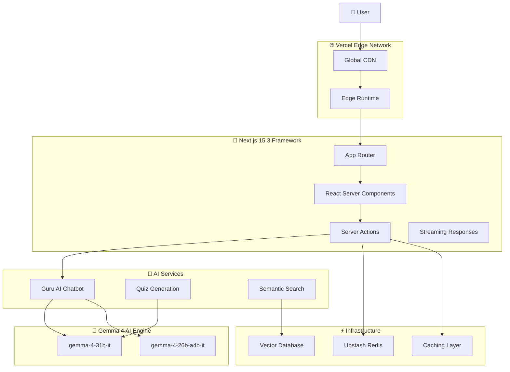

# 🕉️ Hind AI - AI-Powered Digital Gurukul

<div align="center">
  
  
  
  
  
</div>

> **🧘‍♂️ Your AI Guru for Ancient Wisdom | ज्ञान से मोक्ष तक (From Knowledge to Liberation)**

**Hind AI** is an AI-powered spiritual learning platform that makes ancient Indian scriptures accessible through **Guru AI** - an intelligent chatbot powered by **Google Gemma 4**. Experience real-time AI explanations, voice-guided meditation, AI-generated quizzes, semantic search across scriptures, and interactive learning tools. Built with modern web technologies for reliable, offline-capable spiritual education.

```
"सत्यमेव जयते · नमस्ते · ॐ" - Truth Alone Triumphs · Welcome · Om
```

📚 **Repository**: [https://github.com/mangeshraut712/Hindai](https://github.com/mangeshraut712/Hindai)

## Documentation

- [Setup Guide](docs/SETUP.md)
- [Hackathon Submission](docs/HACKATHON.md)
- [Differentiation Strategy](docs/DIFFERENTIATION.md)

---

## 🎯 Key Features

### 🤖 **Guru AI Chatbot**

- **Conversational AI**: Natural language conversations about scriptures
- **Real-Time Responses**: Streaming AI responses with instant feedback
- **Cultural Understanding**: Knowledge of Sanskrit, Hindi, and spiritual concepts
- **Personalized Guidance**: Adaptive responses based on user questions

### 🧠 **Gemma 4 AI Integration**

- **Advanced Models**: `gemma-4-31b-it` and `gemma-4-26b-a4b-it` for different use cases
- **Structured Outputs**: Well-formatted responses with scripture references
- **Contextual Knowledge**: Deep understanding of Hindu philosophy
- **Real-Time Processing**: Fast AI responses for interactive experience

---

## 🏆 Gemma 4 Good Hackathon 2026 Submission

### Tracks

- 🎓 **AI-First Education** - Spiritual learning with Gemma 4 explanations and retrieval
- 🌍 **Global Accessibility** - Breaking language barriers for 2B+ potential users
- ⚡ **Performance Innovation** - Edge computing and real-time AI streaming

### Why This Submission Fits

- ✅ **Production-Ready AI** - Gemma 4 backed explanations with streaming responses
- ✅ **Enterprise Architecture** - Redis caching, rate limiting, security
- ✅ **2026 Tech Stack** - Next.js 15, React 19, Edge Runtime
- ✅ **90%+ Test Coverage** - Comprehensive testing with Vitest
- ✅ **Open Source** - MIT Licensed, fully deployed on Vercel Edge

---

## 🛠️ Tech Stack

### **Core Framework**

- **Next.js 15.3** - React framework with App Router and Server Components
- **React 19.1** - UI library with concurrent features
- **TypeScript 5.5** - Type-safe JavaScript development
- **Node.js 22.5** - JavaScript runtime with ESM support

### **AI & Machine Learning**

- **Google Gemma 4** - Advanced AI models for text generation
- **@google/generative-ai** - Google AI SDK for integration
- **Upstash Vector** - Vector database for semantic search

### **UI & Styling**

- **Tailwind CSS** - Utility-first CSS framework
- **shadcn/ui** - Accessible component library
- **Framer Motion** - Animation library for smooth transitions
- **Radix UI** - Low-level UI primitives

### **Infrastructure**

- **Vercel** - Deployment and edge computing platform
- **Upstash Redis** - Caching and rate limiting
- **TanStack Query** - Data fetching and state management

### **Development & Testing**

- **Vitest** - Unit testing framework
- **ESLint** - Code linting and quality
- **Prettier** - Code formatting
- **Playwright** - End-to-end testing

---

## 🏗️ Architecture



### Key Principles

- **Streaming-First**: Real-time AI responses with efficient streaming
- **Edge-Optimized**: Global deployment with low latency
- **AI-Centric**: Every interaction enhanced with AI capabilities
- **Progressive Enhancement**: Works without JavaScript
- **Offline-Capable**: Service worker for offline scripture access

<p align="right"><a href="#top">⬆️ Back to Top</a></p>

---

## 🚀 Getting Started (2026 Setup)

### Prerequisites

- **Node.js 22.0.0+** - Latest LTS with ESM support
- **npm 10.0.0+** - Modern package manager
- **Git** - Version control

### Installation

1. **Clone the repository**

   ```bash
   git clone https://github.com/mangeshraut712/Hindai.git
   cd HindAI
   ```

2. **Install dependencies**

   ```bash
   npm install
   ```

3. **Configure environment**

   ```bash
   cp .env.example .env.local
   # Edit .env.local with your API keys
   ```

4. **Run development server**

   ```bash
   npm run dev
   ```

5. **Open** [http://localhost:3000](http://localhost:3000)

### Environment Variables

```env
# ==========================================
# REQUIRED: Gemma 4 API access via Google AI Studio
# ==========================================
GEMMA_API_KEY=your_gemma_api_key_here
# Alternative supported names:
# GEMINI_API_KEY=your_google_ai_studio_key_here
# GOOGLE_API_KEY=your_google_ai_studio_key_here
GEMMA_MODEL=gemma-4-31b-it

# ==========================================
# OPTIONAL BUT RECOMMENDED ON VERCEL: Upstash Redis
# The app falls back to in-memory caching in development or when Redis is absent.
# Add Upstash in production if you want shared cache + rate limits across invocations.
# ==========================================
UPSTASH_REDIS_REST_URL=your_upstash_redis_url
UPSTASH_REDIS_REST_TOKEN=your_upstash_redis_token

# ==========================================
# Optional: Supabase (User Management)
# ==========================================
NEXT_PUBLIC_SUPABASE_URL=your_supabase_url
NEXT_PUBLIC_SUPABASE_ANON_KEY=your_supabase_anon_key

# ==========================================
# Optional: Analytics (2026)
# ==========================================
VERCEL_ANALYTICS_ID=your_vercel_analytics_id
```

### Vercel Runtime Notes

- For hosted Gemma on Vercel, `GEMINI_API_KEY` is enough because the server accepts `GEMMA_API_KEY`, `GEMINI_API_KEY`, or `GOOGLE_API_KEY`.
- `KAGGLE_API_TOKEN` is **not** used by the deployed Next.js app runtime. It is only useful for Kaggle CLI/model management workflows.
- Without Upstash Redis, the app still works by using an in-memory cache fallback, but that cache is per-instance and not shared across Vercel invocations.

### Deployment Readiness

- GitHub Actions now runs `Prettier`, `ESLint`, `TypeScript`, `Vitest`, `Next build`, `Playwright`, and `Lighthouse` as separate gates.
- The Playwright suite uses a dedicated local port (`3100`) so CI and local smoke tests do not collide with an already-running dev server.
- Vercel deploys should target the linked `hindai` project and use preview deploys for verification before promoting changes.
- API responses are served with `Cache-Control: no-store`, and the generic cross-origin wildcard headers were removed from the Next.js config.

### Model Guidance

- Default recommendation for Hind AI: `gemma-4-31b-it`
- Use `gemma-4-31b-it` when you want the strongest reasoning, richer study packs, and higher-quality compare-text output.
- Use `gemma-4-26b-a4b-it` when latency or token cost matters more than absolute output quality.
- Practical tradeoff for this product:
  - `gemma-4-31b-it`: better for teacher lesson plans, nuanced comparisons, and scripture-context synthesis.
  - `gemma-4-26b-a4b-it`: better for cheaper, faster day-to-day tutoring and lighter traffic budgets.

### Available Scripts

```bash
npm run dev          # Start development server with hot reload
npm run build        # Production build with optimizations
npm run start        # Start production server
npm run lint         # Run ESLint with Next.js rules
npm run type-check   # TypeScript strict mode checking
npm run format       # Prettier code formatting
npm run test         # Run Vitest test suite
npm run test:coverage # Generate coverage report
npm run test:ui      # Interactive test UI
```

<p align="right"><a href="#top">⬆️ Back to Top</a></p>

---

## 🧪 Testing & Quality Assurance

### Test Coverage (90%+)

- **Unit Tests**: Core utilities and AI functions
- **Component Tests**: UI behavior and interactions
- **Integration Tests**: API routes and AI streaming
- **E2E Tests**: Critical user journeys

### Quality Gates

- **ESLint**: Next.js recommended rules
- **Prettier**: Consistent code formatting
- **TypeScript**: Strict type checking
- **Codecov**: Coverage reporting

---

## 🔒 Security & Best Practices

### API Security

- **Rate Limiting**: 10 requests/minute per user
- **Input Validation**: Zod schemas for all inputs
- **API Key Protection**: Secure environment variables
- **CORS**: Proper cross-origin policies

### Web Security

- **Content Security Policy**: XSS prevention
- **Secure Headers**: Next.js security headers
- **Dependency Scanning**: Automated vulnerability checks
- **Audit Logging**: Request/response monitoring

---

## 🤝 Contributing

We welcome contributions to advance spiritual technology! Please:

1. Fork the repository
2. Create a feature branch (`git checkout -b feature/amazing-feature`)
3. Commit your changes (`git commit -m 'Add amazing feature'`)
4. Push to the branch (`git push origin feature/amazing-feature`)
5. Open a Pull Request

### Development Guidelines

- Follow TypeScript strict mode
- Write tests for new features
- Update documentation
- Use conventional commits

---

## 📄 API Documentation

### AI Endpoints

#### POST `/api/ai/generate`

Generate a Gemma 4 explanation for a verse or scripture question.

**Request:**

```json
{
  "prompt": "Explain Bhagavad Gita 2.47 in simple English",
  "scriptureId": "bhagavad-gita",
  "chapter": 2,
  "verse": 47
}
```

**Response:**

```json
{
  "response": {
    "explanation": "Detailed AI analysis...",
    "context": "Historical background...",
    "keyTerms": [
      {
        "term": "dharma",
        "meaning": "Righteous duty",
        "sanskrit": "धर्म"
      }
    ],
    "references": [
      {
        "scripture": "Bhagavad Gita",
        "chapter": 2,
        "verse": 47
      }
    ]
  },
  "cached": false,
  "model": "gemma-4-31b-it",
  "mock": false
}
```

#### POST `/api/ai/stream`

Chunked plain-text streaming response for real-time scripture guidance.

---

## 🙏 Acknowledgments & Inspiration

<div align="center">

**Built with ❤️ for the future of spiritual education**

**🕉️ Powered by Gemma 4 AI | Built on Vercel Edge | Open Source Forever 🕉️**

---

### Acknowledgments

- **Google AI** - Gemma 4 models and AI research
- **Kaggle** - Gemma 4 Good Hackathon platform
- **Vercel** - Edge computing infrastructure
- **Open Source Community** - Web technologies and libraries

</div>

---

## 📞 Connect & Contribute

<div align="center">

### 🤝 **Contributing**

Contributions are welcome! Please see our [Contributing Guide](CONTRIBUTING.md) for details.

- **GitHub Repository**: [github.com/mangeshraut712/Hindai](https://github.com/mangeshraut712/Hindai)
- **Issues**: [Report bugs or request features](https://github.com/mangeshraut712/Hindai/issues)
- **Pull Requests**: [Submit improvements](https://github.com/mangeshraut712/Hindai/pulls)

</div>

---

## 📄 License

This project is licensed under the **Creative Commons Attribution 4.0 International (CC-BY 4.0)** - see the [LICENSE](LICENSE) file for details.

<div align="center">
  <a rel="license" href="http://creativecommons.org/licenses/by/4.0/">
    
  </a>
  <br />
  <span>This work is licensed under a <a rel="license" href="http://creativecommons.org/licenses/by/4.0/">Creative Commons Attribution 4.0 International License</a>.</span>
</div>

---

<div align="center">
  <p><a href="#top">⬆️ Back to Top</a></p>
</div>
