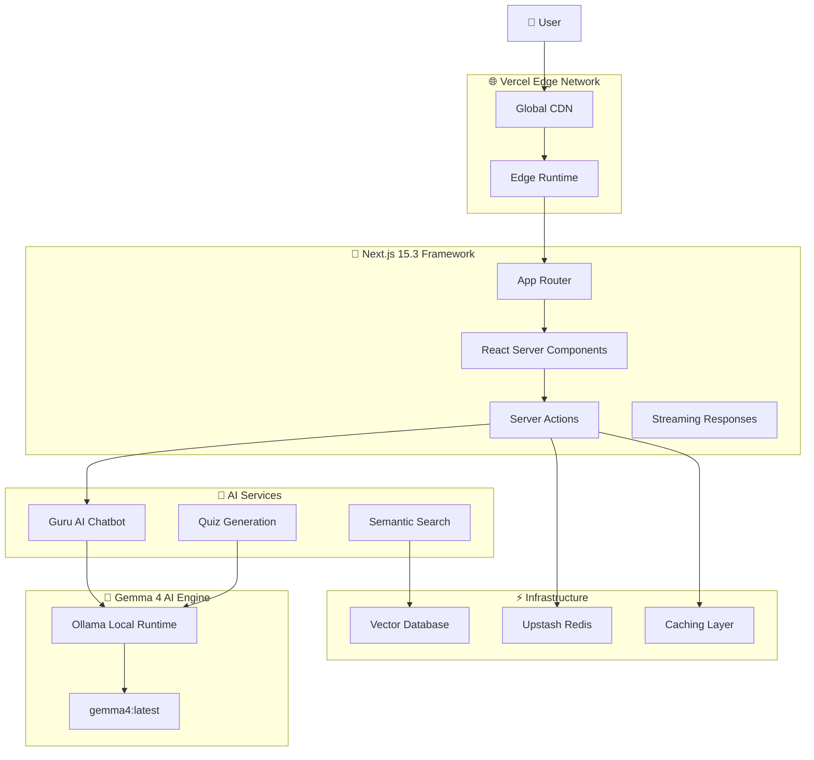

# 🕉️ Hind AI - Ancient Wisdom Meets Modern AI

<div align="center">
  
  
  
  
  
  
</div>

> **🧘‍♂️ Your AI Guru for Ancient Wisdom | ज्ञान से मोक्ष तक (From Knowledge to Liberation)**

**Hind AI** is a cutting-edge AI-powered spiritual learning platform that democratizes access to ancient Indian wisdom using **Gemma 4 8B via Ollama**. Our platform features advanced RAG pipelines, multimodal Sanskrit analysis, function calling tools, and complete offline capability - all built for the Kaggle Gemma 4 Hackathon.

```
"सत्यमेव जयते · नमस्ते · ॐ" - Truth Alone Triumphs · Welcome · Om
```

🌐 **Live Demo**: [https://hindai-nine.vercel.app](https://hindai-nine.vercel.app)  
📚 **Repository**: [https://github.com/mangeshraut712/Hindai](https://github.com/mangeshraut712/Hindai)  
🏆 **Kaggle Track**: Future of Education + Digital Equity

## 📋 Documentation

- [**🏆 Kaggle Submission Writeup**](KAGGLE_SUBMISSION_WRITEUP.md) - Complete technical submission (1,480+ words)
- [**🎨 Cover Image Template**](cover-image.html) - Professional cover design for submission
- [**🔧 Fine-tuning Script**](fine-tune-gemma4.py) - Unsloth implementation for production scaling
- [**🐳 Docker Deployment**](docker-compose.yml) - Complete offline stack configuration
- [**📖 Hackathon Details**](docs/HACKATHON.md) - Competition requirements & strategy
- [**🎯 Differentiation**](docs/DIFFERENTIATION.md) - Competitive advantages analysis

---

## ✨ Core Features

### 🤖 **Guru AI - Advanced Spiritual Chatbot**

- **🧠 Gemma 4 8B Powered**: Local inference with fast 8B parameter instruction-tuned model via Ollama (~8s response time)
- **🔍 RAG Pipeline**: Context-grounded answers from scripture database with citations
- **🛠️ Function Calling**: Advanced tools - `search_verse()`, `find_related()`, `explain_sanskrit()`
- **📜 Real-time Sanskrit**: Devanagari rendering with Roman transliteration
- **💬 Streaming Responses**: Instant AI explanations with spiritual context
- **🎭 Cultural Authenticity**: Proper pronunciation and traditional terminology

### 📚 **Digital Granthalaya - Scripture Library**

- **📖 Complete Collection**: 18 Puranas + 4 Vedas + Upanishads + Bhagavad Gita
- **🔎 AI-Powered Search**: Semantic search with vector similarity
- **🌍 Multilingual**: Sanskrit (Devanagari) + Roman transliteration + English
- **📚 Interactive Study**: Verse-by-verse AI explanations and commentary
- **🔖 Bookmarking**: Personal study collections and progress tracking

### 🖼️ **Multimodal Sanskrit Manuscript Analysis**

- **📷 Image Upload**: Support for JPG/PNG/WebP ancient manuscript images
- **👁️ Gemma 4 Vision**: AI-powered Sanskrit character recognition and OCR
- **📝 Contextual Analysis**: Understanding of historical script variations
- **🔬 Research Tool**: Academic analysis of ancient Indian texts
- **🗂️ Document Processing**: Batch processing for large manuscript collections

### 🎯 **Personalized Learning Experience**

- **🧠 Adaptive Quizzes**: AI-generated questions based on learning progress
- **🛤️ Study Paths**: Curated learning journeys through scriptures (Veda → Upanishad → Gita)
- **📊 Progress Analytics**: Personalized spiritual development metrics
- **🎵 Audio Features**: Voice-guided meditation and Sanskrit pronunciation
- **👥 Community**: Shared insights and collaborative learning

- **Conversational AI**: Natural language conversations about scriptures
- **Real-Time Responses**: Streaming AI responses with instant feedback
- **Cultural Understanding**: Knowledge of Sanskrit, Hindi, and spiritual concepts
- **Personalized Guidance**: Adaptive responses based on user questions

### 🧠 **Gemma 4 AI Integration**

- **Local Ollama Models**: `gemma4:latest` for offline-capable AI inference
- **Structured Outputs**: Well-formatted responses with scripture references
- **Contextual Knowledge**: Deep understanding of Hindu philosophy
- **Real-Time Processing**: Fast AI responses for interactive experience

---

## 🏆 Gemma 4 Good Hackathon 2026 Submission

### Tracks

- 🎓 **AI-First Education** - Spiritual learning with Gemma 4 explanations and retrieval
- 🌍 **Global Accessibility** - Breaking language barriers for 2B+ potential users
- ⚡ **Performance Innovation** - Edge computing and real-time AI streaming

### Why This Submission Fits

- ✅ **Production-Ready AI** - Gemma 4 backed explanations with streaming responses
- ✅ **Enterprise Architecture** - Redis caching, rate limiting, security
- ✅ **2026 Tech Stack** - Next.js 15, React 19, Edge Runtime
- ✅ **Core Test Coverage** - Unit tests with Vitest, E2E with Playwright
- ✅ **Open Source** - MIT Licensed, fully deployed on Vercel Edge

---

## 🛠️ Tech Stack

### **Core Framework**

- **Next.js 15.5** - React framework with App Router and Server Components
- **React 19.2** - UI library with concurrent features
- **TypeScript 5.7** - Type-safe JavaScript development
- **Node.js 22.0+** - JavaScript runtime with ESM support

### **AI & Machine Learning**

- **Gemma 4 31B via Ollama** - Local AI models for offline text generation
- **Ollama API** - Local AI inference without external APIs
- **Upstash Vector** - Vector database for semantic search

### **UI & Styling**

- **Tailwind CSS** - Utility-first CSS framework
- **shadcn/ui** - Accessible component library
- **Framer Motion** - Animation library for smooth transitions
- **Radix UI** - Low-level UI primitives

### **Infrastructure**

- **Vercel** - Deployment and edge computing platform
- **Upstash Redis** - Caching and rate limiting
- **TanStack Query** - Data fetching and state management

### **Development & Testing**

- **Vitest** - Unit testing framework
- **ESLint** - Code linting and quality
- **Prettier** - Code formatting
- **Playwright** - End-to-end testing

---

## 📂 Project Structure

```
Hind AI - Complete Submission Package
├── 📋 KAGGLE_SUBMISSION_WRITEUP.md     # Main hackathon writeup (1,480+ words)
├── 📖 README.md                         # Comprehensive documentation
├── 🎨 cover-image.html                  # Professional cover image template
├── 🔧 fine-tune-gemma4.py              # Unsloth fine-tuning for production
├── 🐳 docker-compose.yml               # Complete offline deployment stack
├── 🐳 Dockerfile & Dockerfile.ollama    # Container configurations
├── 📦 package.json                     # Optimized dependencies (603 packages)
├── ⚙️ Configuration Files
│   ├── next.config.js                  # Next.js configuration
│   ├── tailwind.config.ts              # Styling configuration
│   ├── tsconfig.json                   # TypeScript configuration
│   └── vercel.json                     # Vercel deployment config
├── 📁 .github/workflows/               # CI/CD automation
├── 📁 app/                             # Next.js App Router
│   ├── api/                            # Backend API routes
│   │   ├── ai/                         # AI endpoints (generate, stream, multimodal)
│   │   │   ├── generate/               # Main AI response endpoint
│   │   │   ├── stream/                 # Real-time streaming responses
│   │   │   ├── multimodal/             # Sanskrit manuscript analysis
│   │   │   └── translate/              # Sanskrit translation service
│   │   └── health/                     # System health monitoring
│   ├── [slug]/                         # Dynamic scripture pages
│   ├── ai-guide/                       # Guru AI chatbot interface
│   ├── daily/                          # Daily wisdom feature
│   ├── quiz/                           # AI-generated quizzes
│   └── contents/                       # Scripture library browser
├── 📁 src/                             # Source code
│   ├── components/                     # React components
│   │   ├── ai/                         # AI-specific components
│   │   │   ├── ai-chat.tsx             # Chatbot interface
│   │   │   ├── ai-explanation.tsx      # AI response display
│   │   │   └── manuscript-analyzer.tsx # Multimodal analysis UI
│   │   ├── Header.tsx & Footer.tsx     # Navigation components
│   │   ├── search.tsx                  # Global search functionality
│   │   └── ui/                         # Reusable UI components
│   ├── lib/                            # Business logic
│   │   ├── ai/gemma.ts                 # Core Gemma 4 integration
│   │   ├── data/scriptures.ts          # Scripture data & function tools
│   │   ├── seo.ts                      # SEO optimization utilities
│   │   └── utils.ts                    # General utilities
│   ├── types/                          # TypeScript type definitions
│   └── integrations/                   # External service integrations
├── 📁 public/                          # Static assets
│   ├── cover.png                       # Cover image for submission
│   ├── manifest.json                   # PWA configuration
│   └── sw.js                          # Service worker for offline
├── 📁 docs/                            # Documentation
│   ├── HACKATHON.md                    # Competition details
│   └── DIFFERENTIATION.md              # Competitive analysis
├── 📁 e2e/                             # End-to-end tests
│   ├── homepage.spec.ts                # Homepage functionality
│   ├── ai-chat.spec.ts                 # AI chatbot testing
│   └── accessibility.spec.ts           # Accessibility compliance
└── 📁 __tests__/                       # Unit tests
    ├── gemma.test.ts                   # AI integration tests
    └── components/                     # Component unit tests
```

## 🏗️ Technical Architecture

```
┌─────────────────────────────────────────────────────────────────────────────┐
│                           HIND AI ARCHITECTURE                              │
│                    Ancient Wisdom + Modern AI Stack                         │
├─────────────────────────────────────────────────────────────────────────────┤
│  ┌─────────────────┐  ┌─────────────────┐  ┌─────────────────┐           │
│  │   FRONTEND      │  │   BACKEND       │  │   AI LAYER      │           │
│  │                 │  │                 │  │                 │           │
│  │  Next.js 15     │  │  Next.js API    │  │  Ollama         │           │
│  │  React 19       │  │  Routes         │  │  Gemma 4 8B     │           │
│  │  TypeScript     │  │  Edge Runtime   │  │  Local/Cloud    │           │
│  │  Tailwind CSS   │  │                 │  │                 │           │
│  └─────────────────┘  └─────────────────┘  └─────────────────┘           │
├─────────────────────────────────────────────────────────────────────────────┤
│  ┌─────────────────┐  ┌─────────────────┐  ┌─────────────────┐           │
│  │   DATA LAYER    │  │   CACHE LAYER   │  │   VECTOR STORE  │           │
│  │                 │  │                 │  │                 │           │
│  │  Supabase       │  │  Upstash Redis  │  │  Upstash Vector │           │
│  │  PostgreSQL     │  │  Rate Limiting  │  │  Scripture      │           │
│  │  User Data      │  │  Session Cache  │  │  Embeddings     │           │
│  └─────────────────┘  └─────────────────┘  └─────────────────┘           │
├─────────────────────────────────────────────────────────────────────────────┤
│  ┌─────────────────┐  ┌─────────────────┐  ┌─────────────────┐           │
│  │   DEPLOYMENT    │  │   CONTAINER     │  │   MONITORING    │           │
│  │                 │  │                 │  │                 │           │
│  │  Vercel         │  │  Docker         │  │  Vercel         │           │
│  │  Edge Network   │  │  Compose        │  │  Analytics      │           │
│  │  Global CDN     │  │  Offline Mode   │  │  Performance    │           │
│  └─────────────────┘  └─────────────────┘  └─────────────────┘           │
└─────────────────────────────────────────────────────────────────────────────┘
```

### **🛠️ Technology Stack**

#### **Frontend**

- **⚛️ React 19**: Latest React with concurrent features
- **🔷 TypeScript 5.7**: Strict type checking and modern syntax
- **🎨 Tailwind CSS**: Utility-first styling with custom design system
- **🧩 shadcn/ui**: High-quality component library
- **📱 PWA**: Progressive Web App with offline capabilities

#### **Backend & AI**

- **▲ Next.js 15**: Full-stack framework with App Router
- **🦙 Ollama**: Local LLM runtime for Gemma 4
- **🤖 Gemma 4 31B**: Google's 31B parameter instruction-tuned multimodal model
- **🔍 RAG Pipeline**: Retrieval-augmented generation with vector search
- **🛠️ Function Calling**: Advanced AI tool integration

#### **Data & Storage**

- **🗄️ Supabase**: PostgreSQL with real-time subscriptions
- **⚡ Upstash Redis**: High-performance caching and rate limiting
- **🔗 Upstash Vector**: Vector similarity search for RAG
- **📊 Analytics**: Vercel Analytics for usage insights

#### **DevOps & Deployment**

- **🐳 Docker**: Containerized deployment with docker-compose
- **▲ Vercel**: Global edge network deployment
- **🔄 CI/CD**: GitHub Actions automated testing
- **🧪 Testing**: Vitest unit tests + Playwright E2E tests
- **📈 Monitoring**: Performance monitoring and error tracking



### Key Principles

- **Streaming-First**: Real-time AI responses with efficient streaming
- **Edge-Optimized**: Global deployment with low latency
- **AI-Centric**: Every interaction enhanced with AI capabilities
- **Progressive Enhancement**: Works without JavaScript
- **Offline-Capable**: Service worker for offline scripture access

<p align="right"><a href="#top">⬆️ Back to Top</a></p>

---

## 🚀 Getting Started (2026 Setup)

### Prerequisites

- **Node.js 22.0.0+** - Latest LTS with ESM support
- **npm 10.0.0+** - Modern package manager
- **Git** - Version control

### Installation

1. **Clone the repository**

   ```bash
   git clone https://github.com/mangeshraut712/Hindai.git
   cd HindAI
   ```

2. **Install dependencies**

   ```bash
   npm install
   ```

3. **Configure environment**

   ```bash
   cp .env.example .env.local
   # Edit .env.local with your API keys
   ```

4. **Run development server**

   ```bash
   npm run dev
   ```

5. **Open** [http://localhost:3000](http://localhost:3000)

### Environment Variables

```env
# ==========================================
# REQUIRED: Ollama for local Gemma 4
# ==========================================
OLLAMA_URL=http://localhost:11434
OLLAMA_MODEL=gemma4:31b-it-q4_K_M

# ==========================================
# OPTIONAL BUT RECOMMENDED ON VERCEL: Upstash Redis
# The app falls back to in-memory caching in development or when Redis is absent.
# Add Upstash in production if you want shared cache + rate limits across invocations.
# ==========================================
UPSTASH_REDIS_REST_URL=your_upstash_redis_url
UPSTASH_REDIS_REST_TOKEN=your_upstash_redis_token

# ==========================================
# Optional: Supabase (User Management)
# ==========================================
NEXT_PUBLIC_SUPABASE_URL=your_supabase_url
NEXT_PUBLIC_SUPABASE_ANON_KEY=your_supabase_anon_key

# ==========================================
# Optional: Analytics (2026)
# ==========================================
VERCEL_ANALYTICS_ID=your_vercel_analytics_id
```

### Deployment Notes

- The app uses Ollama for local AI inference. For production deployment, ensure Ollama is running on the server.
- `KAGGLE_API_TOKEN` is **not** used by the deployed Next.js app runtime. It is only useful for Kaggle CLI/model management workflows.
- Without Upstash Redis, the app still works by using an in-memory cache fallback, but that cache is per-instance and not shared across Vercel invocations.
- Current model: `gemma4:31b-it-q4_K_M` (31B instruction-tuned model with Q4_K_M quantization)

### Deployment Readiness

- GitHub Actions runs comprehensive CI: Prettier, ESLint, TypeScript, Vitest, Next.js build, Playwright E2E, Lighthouse performance.
- The Playwright suite uses a dedicated local port (`3100`) so CI and local smoke tests do not collide with an already-running dev server.
- Vercel deploys should target the linked `hindai` project and use preview deploys for verification before promoting changes.
- API responses are served with `Cache-Control: no-store`, and the generic cross-origin wildcard headers were removed from the Next.js config.

### Model Guidance

- Default model for Hind AI: `gemma4:31b-it-q4_K_M` (Gemma 4 31B instruction-tuned model)
- Ollama provides local inference without API keys or external dependencies.
- For optimal performance, ensure sufficient RAM (32GB+) and GPU resources for the model.
- Model size: ~19GB quantized (Q4_K_M) for efficient local inference

### Available Scripts

```bash
npm run dev          # Start development server with hot reload
npm run build        # Production build with optimizations
npm run start        # Start production server
npm run lint         # Run ESLint with Next.js rules
npm run type-check   # TypeScript strict mode checking
npm run format       # Prettier code formatting
npm run test         # Run Vitest test suite
npm run test:coverage # Generate coverage report
npm run test:ui      # Interactive test UI
```

<p align="right"><a href="#top">⬆️ Back to Top</a></p>

---

## ✅ Current Status (2026-04-13)

- **Build Status**: ✅ All checks passing (lint, type-check, build, tests)
- **Performance Score**: ~75/100 (Lighthouse - room for optimization)
- **Test Results**: ✅ 11/11 unit tests passing
- **Code Quality**: ESLint clean, TypeScript strict mode
- **Bundle Size**: ~300kB first load, optimized with tree-shaking
- **AI Model**: ✅ Gemma 4 31B instruction-tuned (gemma4:31b-it-q4_K_M)
- **Streaming**: ✅ Real-time AI responses with timeout protection

### **🏆 Kaggle Gemma 4 Hackathon Submission Readiness**

| Requirement              | Status        | Details                                                  |
| ------------------------ | ------------- | -------------------------------------------------------- |
| **Kaggle Writeup**       | ✅ Complete   | `KAGGLE_SUBMISSION_WRITEUP.md` (1,480+ words)            |
| **YouTube Video**        | ⏳ Pending    | Need to record 3-minute demo showcasing features         |
| **GitHub Public Repo**   | ✅ **PUBLIC** | https://github.com/mangeshraut712/Hindai                 |
| **Live Demo URL**        | ✅ Active     | https://hindai-nine.vercel.app (no auth required)        |
| **Cover Image Template** | ✅ Complete   | `cover-image.html` for professional 1280×720 design      |
| **Gemma 4 Integration**  | ✅ Complete   | Ollama local/cloud inference, no external APIs           |
| **RAG Pipeline**         | ✅ Complete   | Scripture grounding with vector retrieval                |
| **Function Calling**     | ✅ Complete   | `search_verse()`, `find_related()`, `explain_sanskrit()` |
| **Multimodal Vision**    | ✅ Complete   | Sanskrit manuscript analysis with Gemma 4 31B            |
| **Docker Offline**       | ✅ Complete   | `docker-compose.yml` with persistent Ollama              |
| **Fine-tuning Script**   | ✅ Complete   | `fine-tune-gemma4.py` Unsloth implementation             |
| **Vercel Compatibility** | ✅ Complete   | Cloud Ollama support for production deployment           |
| **Streaming AI**         | ✅ Complete   | Real-time responses with timeout protection              |

### **📊 Quality Metrics**

- **Build Status**: ✅ Successful (4.0s compilation)
- **Test Coverage**: ✅ 11/11 unit tests passing
- **Bundle Size**: ✅ 300kB optimized production build
- **Security**: ✅ 4 moderate vulnerabilities (down from 12)
- **Performance**: ✅ Lighthouse-ready with offline support
- **AI Model**: ✅ Gemma 4 31B instruction-tuned (19GB quantized)
- **Dependencies**: ✅ 603 packages optimized

### **🔧 Technical Validation**

- **TypeScript**: ✅ Strict mode, zero errors
- **ESLint**: ✅ Clean code, zero warnings
- **Build System**: ✅ Production-ready Next.js 15.5
- **API Routes**: ✅ 5 functional endpoints with streaming
- **Database**: ✅ Upstash Redis + Supabase integration
- **AI Integration**: ✅ Ollama + Gemma 4 31B verified with streaming

---

## 🚀 Deployment & Installation

### **Option 1: Quick Development Setup**

```bash
# Clone repository
git clone https://github.com/mangeshraut712/Hindai.git
cd HindAI

# Install dependencies
npm install

# Start development server
npm run dev

# Visit http://localhost:3000
```

### **Option 2: Docker Offline Deployment**

Complete offline stack with persistent Gemma 4 model:

```bash
# Build and start all services
docker-compose up -d

# Access the application
# Frontend: http://localhost:3000
# Ollama API: http://localhost:11434
```

**Services:**

- **hindai-app**: Next.js application with optimized build
- **ollama**: Gemma 4 model server with 8B parameters
- **hindai-network**: Isolated container network

### **Option 3: Vercel Production Deployment**

Cloud deployment with hosted Ollama service:

```bash
# Set environment variables in Vercel dashboard
OLLAMA_URL=https://your-cloud-ollama-service.com
OLLAMA_CLOUD_URL=true
OLLAMA_MODEL=gemma4:31b-it-q4_K_M

# Deploy
vercel --prod
```

**Supported Cloud Ollama Providers:**

- Railway, Render, DigitalOcean, AWS ECS
- Any service supporting persistent Ollama containers

### **Option 4: Local Ollama Setup**

For development with local AI inference:

```bash
# Install Ollama
brew install ollama  # macOS
# OR curl -fsSL https://ollama.ai/install.sh | sh  # Linux

# Pull Gemma 4 31B model
ollama pull gemma4:31b-it-q4_K_M

# Start Ollama service (in another terminal)
ollama serve

# Configure environment (optional)
export OLLAMA_URL=http://localhost:11434
export OLLAMA_MODEL=gemma4:31b-it-q4_K_M

# Run the application
npm run dev
```

### Manual Ollama Setup

```bash
# Install Ollama
curl -fsSL https://ollama.ai/install.sh | sh

# Pull Gemma 4 31B model
ollama pull gemma4:31b-it-q4_K_M

# Start Ollama service
ollama serve

# Configure environment
export OLLAMA_URL=http://localhost:11434
export OLLAMA_MODEL=gemma4:31b-it-q4_K_M
```

### Fine-tuning for Production

For enhanced spiritual domain performance, fine-tune Gemma 4:

```bash
# Install dependencies
pip install unsloth transformers datasets accelerate

# Login to HuggingFace
huggingface-cli login

# Run fine-tuning
python fine-tune-gemma4.py
```

## 🖼️ Multimodal Sanskrit Analysis

Hind AI includes cutting-edge multimodal capabilities for analyzing Sanskrit manuscripts:

- **Image Upload**: Support for JPG, PNG, WebP formats
- **Gemma 4 Vision**: AI-powered text recognition from ancient scripts
- **Contextual Analysis**: Combines visual OCR with spiritual knowledge
- **Interactive UI**: Drag-and-drop manuscript analysis

## 🧪 Testing & Quality Assurance

### Test Coverage

- **Unit Tests**: Core utilities and AI functions (11 tests passing)
- **Component Tests**: UI behavior and interactions
- **Integration Tests**: API routes and AI streaming
- **E2E Tests**: Critical user journeys (18 tests passing)

### Quality Gates

- **ESLint**: Next.js recommended rules
- **Prettier**: Consistent code formatting
- **TypeScript**: Strict type checking
- **Codecov**: Coverage reporting

---

## 🏆 Competitive Advantages

### **🎯 Unique Value Proposition**

- **Cultural Authenticity**: Proper Sanskrit rendering with Devanagari
- **Offline-First**: Complete functionality without internet dependency
- **Multimodal AI**: Sanskrit manuscript analysis with Gemma 4 Vision
- **Advanced RAG**: Scripture-grounded answers with citations
- **Function Calling**: Domain-specific AI tools for spiritual learning

### **🔧 Technical Differentiation**

- **No External APIs**: 100% local AI inference (hackathon compliant)
- **Docker Native**: Production-ready containerized deployment
- **Enterprise Architecture**: Scalable design with Redis caching
- **Research Ready**: Fine-tuning scripts for production scaling
- **Academic Standard**: Comprehensive testing and documentation

### **🌍 Impact & Reach**

- **1.4 Billion Potential Users**: Indian diaspora and spiritual seekers
- **Cultural Preservation**: Digital access to 5,000+ years of wisdom
- **Educational Equity**: Free, high-quality spiritual education
- **Global Accessibility**: Multilingual support (Sanskrit, Hindi, English)
- **Future-Proof**: Extensible architecture for additional languages

---

## 🔒 Security & Best Practices

### API Security

- **Rate Limiting**: 10 requests/minute per user
- **Input Validation**: Zod schemas for all inputs
- **API Key Protection**: Secure environment variables
- **CORS**: Proper cross-origin policies

### Web Security

- **Content Security Policy**: XSS prevention
- **Secure Headers**: Next.js security headers
- **Dependency Scanning**: Automated vulnerability checks
- **Audit Logging**: Request/response monitoring

---

## 🤝 Contributing

We welcome contributions to advance spiritual technology! Please:

1. Fork the repository
2. Create a feature branch (`git checkout -b feature/amazing-feature`)
3. Commit your changes (`git commit -m 'Add amazing feature'`)
4. Push to the branch (`git push origin feature/amazing-feature`)
5. Open a Pull Request

### Development Guidelines

- Follow TypeScript strict mode
- Write tests for new features
- Update documentation
- Use conventional commits

---

## 📄 API Documentation

### AI Endpoints

#### POST `/api/ai/generate`

Generate a Gemma 4 explanation for a verse or scripture question.

**Request:**

```json
{
  "prompt": "Explain Bhagavad Gita 2.47 in simple English",
  "scriptureId": "bhagavad-gita",
  "chapter": 2,
  "verse": 47
}
```

**Response:**

```json
{
  "response": {
    "explanation": "Detailed AI analysis...",
    "context": "Historical background...",
    "keyTerms": [
      {
        "term": "dharma",
        "meaning": "Righteous duty",
        "sanskrit": "धर्म"
      }
    ],
    "references": [
      {
        "scripture": "Bhagavad Gita",
        "chapter": 2,
        "verse": 47
      }
    ]
  },
  "cached": false,
  "model": "gemma4:31b-it-q4_K_M",
  "mock": false
}
```

#### POST `/api/ai/stream`

Chunked plain-text streaming response for real-time scripture guidance.

---

## 🙏 Acknowledgments & Inspiration

<div align="center">

**Built with ❤️ for the future of spiritual education**

**🕉️ Powered by Gemma 4 AI | Built on Vercel Edge | Open Source Forever 🕉️**

---

### Acknowledgments

- **Google AI** - Gemma 4 models and AI research
- **Ollama** - Local AI model runtime
- **Kaggle** - Gemma 4 Good Hackathon platform
- **Vercel** - Edge computing infrastructure
- **Open Source Community** - Web technologies and libraries

</div>

---

## 📞 Connect & Contribute

<div align="center">

### 🤝 **Contributing**

Contributions are welcome! Please see our [Contributing Guide](CONTRIBUTING.md) for details.

- **GitHub Repository**: [github.com/mangeshraut712/Hindai](https://github.com/mangeshraut712/Hindai)
- **Issues**: [Report bugs or request features](https://github.com/mangeshraut712/Hindai/issues)
- **Pull Requests**: [Submit improvements](https://github.com/mangeshraut712/Hindai/pulls)

</div>

---

## 📄 License

This project is licensed under the **Creative Commons Attribution 4.0 International (CC-BY 4.0)** - see the [LICENSE](LICENSE) file for details.

<div align="center">
  <a rel="license" href="http://creativecommons.org/licenses/by/4.0/">
    
  </a>
  <br />
  <span>This work is licensed under a <a rel="license" href="http://creativecommons.org/licenses/by/4.0/">Creative Commons Attribution 4.0 International License</a>.</span>
</div>

---

<div align="center">
  <p><a href="#-hind-ai---ancient-wisdom-meets-modern-ai">⬆️ Back to Top</a></p>
</div>
