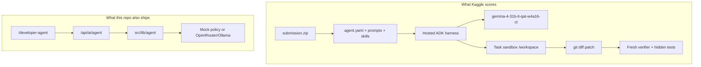

# Google — The Gemma 4 Developer Agent Competition (research notes)

Hind AI's contest entry is documented here from **primary pages fetched on 2026-09-28**. Nothing below is a score, a leaderboard rank, or a claim about hidden-test performance. Unverified items are marked.

## What this contest actually is

This is a **featured prediction competition**, not a product-demo hackathon. You post-train or configure an autonomous coding agent on a **fixed Gemma 4 checkpoint**. Kaggle runs the agent on hidden Python issues and scores **patches**.

Primary sources:

- Overview: [https://www.kaggle.com/competitions/gemma-4-developer-agent](https://www.kaggle.com/competitions/gemma-4-developer-agent)
- Rules: [https://www.kaggle.com/competitions/gemma-4-developer-agent/rules](https://www.kaggle.com/competitions/gemma-4-developer-agent/rules)
- Data: [https://www.kaggle.com/competitions/gemma-4-developer-agent/data](https://www.kaggle.com/competitions/gemma-4-developer-agent/data)
- Paper track: [https://www.kaggle.com/competitions/gemma-4-developer-agent-paper](https://www.kaggle.com/competitions/gemma-4-developer-agent-paper)
- ADK Agent Config (general, not competition-restricted): [https://google.github.io/adk-docs/agents/config/](https://google.github.io/adk-docs/agents/config/)

Independent secondary writeup of the harness (not official): [Pilkwang Kim, 2026-09-25](https://pilkwangkim.github.io/posts/Gemma-4-Developer-Agent-From-Issue-to-Verified-Patch/). Used only where it quotes Overview/HARNESS fields we could not download (dataset gated on accepting rules).

## Timeline (11:59 PM UTC unless noted)

From Overview > Timeline:

| Date                        | Event                                                         |
| --------------------------- | ------------------------------------------------------------- |
| 23 September 2026           | Start                                                         |
| 12 November 2026 (optional) | Research paper deadline (also the paper-track final deadline) |
| 25 November 2026            | Entry deadline (must accept rules) and team-merger deadline   |
| 2 December 2026             | Final submission deadline                                     |

"2 months to go" on the competition header is consistent with a December 2026 close as of this fetch, not a separate deadline.

Paper track Overview lists start **22 September 2026** and final writeup deadline **12 November 2026**.

## Leaderboard deliverable (required)

Upload a zip named **`submission.zip`**. `agent.yaml` must be at the **zip root**. The Overview tree is:

```
submission.zip
├── agent.yaml                  # REQUIRED
├── configs/                    # optional !include files
├── prompts/
├── sub_agents/
├── adapters/                   # optional PEFT LoRA dirs
└── skills/                     # optional ADK skills
```

`eval_config.yaml` is allowed for per-task limits (Overview). Secondary source: hosted scorer reads `timeout_seconds`, `max_tool_calls`, `max_time_minutes`, `max_turns` under an `evaluation:` key.

**Not required for the prediction contest (Overview/Rules):** Kaggle notebook, demo video, public writeup, or a web app. Those do not replace `submission.zip`.

**Winners (Rules §2.5, §2.8):** open-source license that does not limit commercial use (competition-specific winner license type listed as Apache 2.0); deliver training/inference code and docs so the sponsor can reproduce. Hind AI's site license is CC-BY-4.0; the agent package should be treatable as Apache-2.0 if it wins — **Mangesh must confirm license intent**.

## Paper track deliverable (optional, separate join)

From the paper-track Overview:

1. Kaggle Writeup (title, subtitle, abstract, introduction, methods/experiments, related work). Max **3,000 words**.
2. Optional public notebook and/or arXiv-ready PDF via Project Links.
3. Draft writeups that are not clicked **Submit** by the deadline are ignored.

Rubric (equal weight, 0–5 each, average): Novelty, Quality, Relevance, Verifiability, Clarity. Prizes: Best Paper $15k, Best New Resource $10k, Best New Application $10k.

## Evaluation (prediction contest)

- Similar to SWE-bench: apply the agent patch to the issue repo, run that issue's validation tests, **PASS/FAIL**.
- Score = percentage of patched repositories that pass.
- Agent budget: **12 hours** for all patches including sandbox setup, **excluding** patch validation.
- Public development set: **129** tasks in `tasks.jsonl` (FastAPI, Rich, Requests, HTTPX per Data page). Hidden test: about **120** tasks from private repos, public/private leaderboard split.
- Output artifact during scoring: `/kaggle/working/submission.parquet` with `id` and `prediction` (unified diff or `NO_PATCH`).

No qualitative "wow" rubric on the prediction leaderboard. Explanations do not score.

## Model, tools, skills (hard constraints)

From Overview > Model Selection, Budget, and Harness Rules:

- **Only** `gemma-4-31b-it-qat-w4a16-ct` for every agent and subagent. Host supplies the base model.
- Optional LoRA: PEFT dirs with `adapter_config.json` + `adapter_model.safetensors` under `adapters/<name>/`, referenced as `adapter: <name>`.
- Tools: only harness tools or custom subagents via `agent_tool`. No arbitrary host Python entrypoint.
- Predefined tools: `run_command`, `submit_patch`, `get_status`, `read_file`, `edit_file`, `write_file`, `get_code_neighbors`, `search_similar_code`, `get_code_subgraph`.
- Skills: directory + `SKILL.md` with `name:` frontmatter. Scripts via `run_skill_script` in the Docker sandbox; knowledge via `load_skill_resource`.
- `!include` is relative to the file containing the tag. No `../` path traversal or symlinks.

### Unverified here (dataset gated)

Full `HARNESS_README.md`, sample_submission YAML dialect, GPU layout, 32k context, 3 GiB unpacked cap, sandbox RAM. Secondary writeup reports four L4 GPUs / 96 GB VRAM, 32,768-token context, unpacked zip **&lt; 3 GiB**, sandbox 4 GiB RAM / 2 vCPUs, command output truncated ~5,000 chars, `read_file` ~150 lines / 10k chars. **Treat as unofficial until Mangesh downloads the dataset.**

`search_similar_code` is described on the Data page as cosine similarity over **indexed node embeddings**, not a fresh embedding of English issue text. Secondary source agrees: query with a symbol id or suffix.

## Rules that affect how we work in this public repo

From Rules (fetched 2026-09-28):

- Max team size **5**. **1 submission per day**. Select up to **2** final submissions.
- No private sharing of competition code/data outside the team. Public sharing must be on the Kaggle forum/notebooks for this competition.
- External data allowed if public, equally accessible, reasonable cost.
- Eligibility: Kaggle account, 18+/majority, not in sanctioned regions listed in foundational rules.
- Employees of competition entities may enter but cannot win prizes.

Publishing a full agent package on GitHub **may** be treated as public sharing. Safer for ranking: keep LoRA/training secrets off GitHub if they encode competition-data overfitting; this baseline contains **no adapters and no competition snapshots**.

## How Hind AI maps onto this

| Hind AI today                                                                              | Contest                                                     |
| ------------------------------------------------------------------------------------------ | ----------------------------------------------------------- |
| Scripture/tirtha static site + Cloudflare Workers AI Gemma 4 26B A4B / OpenRouter 31B chat | Unrelated to leaderboard score                              |
| This repo's `kaggle/gemma4-developer-agent/`                                               | The actual `submission.zip` contents                        |
| `/developer-agent` studio + `src/lib/agent` mock loop                                      | Local inspectability; default backend is mock               |
| Optional `OPENROUTER_API_KEY` / Ollama                                                     | Live Gemma 4 for the studio only, **not** the hosted scorer |

We did **not** run the 22.42 GB Kaggle dataset, Docker sandbox, or hosted 31B QAT checkpoint in this environment.

## Submission checklist for Mangesh

1. Accept rules on both contest pages (entry deadline 25 Nov 2026).
2. `python3 kaggle/gemma4-developer-agent/build_submission.py`
3. Upload `kaggle/dist/submission.zip` (1/day).
4. Optional: join paper track, paste `docs/KAGGLE_GEMMA4_WRITEUP.md`, click Submit by 12 Nov 2026.
5. Optional: download competition data after accepting rules; run official local eval; iterate prompts/LoRA.

## Architecture


